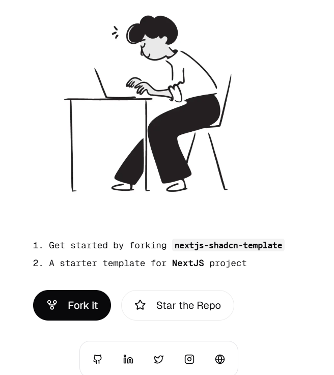

### NEXTJS TEMPLATE

This is a template for a NextJS project. It includes the following features:

<div align="center">
	<table>
		<tr>
			<td><code></code></td>
			<td><code></code></td>
			<td><code></code></td>
			<td><code></code></td>
		</tr>
	</table>
</div>

<div align="center">
    
</div>

Getting Started
---------------
1. Clone the repository
```bash
git clone https://github.com/yashksaini-coder/nextjs-shadcn-template
```

2. Install dependencies
```bash
npm install
```

3. Start the development server
```bash
npm run dev
```

4. Build for production
```bash
npm run build
```

5. Start the production server
```bash
npm start
```

### Features

- [x] Tailwind CSS
- [x] ShadCn UI
- [x] TypeScript
- [x] Next.js
